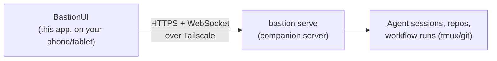

# BastionUI

An Android app that lets you monitor and control a fleet of AI coding agents from your phone or tablet — while they run on a machine somewhere else on your network.

## What this is for

The author runs several autonomous coding-agent sessions (Claude Code, driving real git repos) on a home server. Those sessions sometimes need a human: approve a decision, answer a prompt, or just check status. **BastionUI is the remote control for that** — it is a thin Flutter client with no logic of its own; every fact it shows comes from a companion server.

- **`bastion serve`** is that companion server: an HTTP + WebSocket API, part of the [`bastion`](https://github.com/bredmond1019/bastion) CLI, that exposes the state of running agent sessions, git repo status, and workflow runs.
- **Tailscale** is a VPN mesh (a "tailnet") that lets the phone reach the server from anywhere without exposing it to the public internet. BastionUI only ever talks to the tailnet — it never shells out to git/tmux itself.
- This app is **Android-only** by design (no `ios/` directory) — it targets a phone/tablet on the same tailnet as the operator's home server.



1. You open BastionUI on an Android phone or tablet.
2. It connects to a `bastion serve` instance over your Tailscale network, sending a bearer token with every request.
3. `bastion serve` reports on — and lets you act on — the agent sessions, repos, and workflow runs it manages.

## Maturity

This is a working app under active daily use by its one operator, not a finished public product. Expect the server API contract to move (it is versioned and pinned — see [`docs/api-reference.md`](docs/api-reference.md)), and expect rough edges outside the paths the operator uses regularly.

## Quickstart

Run these from this repo's root, in a terminal:

```bash
flutter pub get                 # 1. install dependencies
flutter run -d <device-id>      # 2. build + launch on a connected device/emulator
```

Then, on the device, open the app's **Settings** screen (gear icon in the app bar) and enter:

| Field | Value |
|---|---|
| Host | Your `bastion serve` machine's Tailscale IP or hostname |
| Port | The port `bastion serve` is bound to (compiled-in default is `4317`; confirm the actual bound port with whoever runs your server) |
| Token | The bearer token configured on that `bastion serve` instance |

The token is stored on-device via `flutter_secure_storage` (never plain preferences).

To install onto a real device wirelessly (no cable) and pair it over Tailscale, see [`docs/device-install.md`](docs/device-install.md).

### Prerequisites

| Requirement | Version / detail | Where to check |
|---|---|---|
| Flutter SDK | Dart SDK `^3.12.2` | [`pubspec.yaml`](pubspec.yaml) `environment.sdk` |
| Android SDK | Any recent Android Studio install; `flutter doctor` should be clean | `flutter doctor` |
| A running `bastion serve` | Reachable over Tailscale; this app has no backend of its own | [`bastion`](https://github.com/bredmond1019/bastion) repo, `docs/serve-api.md` |
| A device or emulator | `flutter devices` should list at least one | — |

## What's built today

Five bottom-navigation tabs, a Settings screen, and three detail/sheet screens, all in [`lib/screens/`](lib/screens/):

| Screen | What it shows |
|---|---|
| Briefing | Ranked "what needs you" home tab: gates + needs-input sessions, blocked work, live runs |
| Sessions | List of live agent sessions, drilling into a pane view + input controls per session |
| Dashboard | Portfolio view — repos tiered by needs-attention / active / quiet, with age + activity indicators |
| Actions | Quick-action command palette to inject commands into a running session |
| Runs | Live list of workflow runs with pause/resume/abort control and per-run drill-in |
| Settings | Server host/port/token configuration (pushed from the app bar, not a tab) |

Full screen-by-screen detail, including which providers and routes back each one: [`docs/pages.md`](docs/pages.md). Module/data-flow map: [`docs/architecture.md`](docs/architecture.md). REST + WebSocket client surface: [`docs/api-reference.md`](docs/api-reference.md).

## Running the test suite

Typed in this repo's root:

```bash
dart format --output=none --set-exit-if-changed .   # format check (gating)
flutter analyze                                       # static analysis (gating)
flutter test --exclude-tags e2e                       # unit + widget + integration tests (gating)
```

There is a third, non-gating tier: end-to-end tests that spawn a real `bastion serve` process and drive the app's real (non-mocked) network clients against it.

```bash
flutter test --tags e2e     # needs a built `bastion` binary; self-skips if none is found
```

What each tier answers, and what it costs to run: [`docs/testing.md`](docs/testing.md).

### Manual dev environment (device/emulator + a real server)

For clicking around against real data, or running the e2e tier by hand:

```bash
scripts/start_dev_env.sh            # boots an emulator + bastion serve, then `flutter run`
scripts/start_dev_env.sh --no-run   # same, but stops after printing connection info
```

This reuses an already-attached device/already-running server if it finds one, and only tears down what it started, and only on failure. Full behavior: [`docs/testing.md`](docs/testing.md#manual-dev-environment--device--a-real-bastion-serve).

## Directory map

```
bastion-ui/
├── lib/
│   ├── main.dart       ← app entry: socket/API lifecycle, routing, tab bar
│   ├── screens/        ← the tabs + Settings, plus repo/session detail and the launch sheet
│   ├── services/       ← BastionApi (REST), BastionSocket (WS), EngineApi, notifications
│   ├── state/          ← riverpod providers
│   ├── models/         ← pure-Dart DTOs + WS frame (de)serialization
│   ├── theme/          ← design tokens, dark-only Material theme, typography
│   └── widgets/        ← brand primitives + shared widgets
├── test/               ← unit/widget, integration, and e2e tiers (see docs/testing.md)
├── android/            ← the only platform folder — this is Android-only
├── docs/               ← architecture, API reference, screens, testing, device install
└── scripts/            ← start_dev_env.sh, Patrol smoke test runner
```

## Documentation

| Doc | Contents |
|---|---|
| [`docs/architecture.md`](docs/architecture.md) | Module map, key types, data flow |
| [`docs/api-reference.md`](docs/api-reference.md) | `BastionApi` REST methods, `BastionSocket` frames/topics, DTOs |
| [`docs/pages.md`](docs/pages.md) | Every screen, its route, and the providers/widgets it wires together |
| [`docs/testing.md`](docs/testing.md) | The three test tiers, and the manual dev-environment bootstrap |
| [`docs/device-install.md`](docs/device-install.md) | Wireless install onto a real Android device and connecting it over Tailscale |

## Troubleshooting

| Symptom | Likely cause | What to check |
|---|---|---|
| App shows "Configure a connection" indefinitely | No host saved yet, or the saved config is empty | Open Settings and fill in host/port/token |
| Connection banner shows disconnected/reconnecting | `bastion serve` not reachable at the configured host:port, or Tailscale is not connected on the device | Confirm the server is up and the device's Tailscale app (not just its enrollment) shows connected |
| Everything works in `flutter run` but a release build has no network access at all | A known past defect: the Android `INTERNET` permission was only declared in the debug/profile manifests, not `main` | `test/android_manifest_test.dart` guards this one symptom; see [`docs/testing.md`](docs/testing.md) for the general class |
| A new `BastionApi` route has no integration test | The coverage guard test enforces this | `test/integration/api_coverage_guard_test.dart` fails naming the missing method |

## License

Licensed under either of

- Apache License, Version 2.0 ([LICENSE-APACHE](LICENSE-APACHE) · <http://www.apache.org/licenses/LICENSE-2.0>)
- MIT license ([LICENSE-MIT](LICENSE-MIT) · <http://opensource.org/licenses/MIT>)

at your option. Unless you explicitly state otherwise, any contribution intentionally submitted for inclusion in this work by you, as defined in the Apache-2.0 license, shall be dual licensed as above, without any additional terms or conditions.

Built for one operator and released because it may be useful to others — there is no support obligation, no issue-response SLA, and no stability promise.
