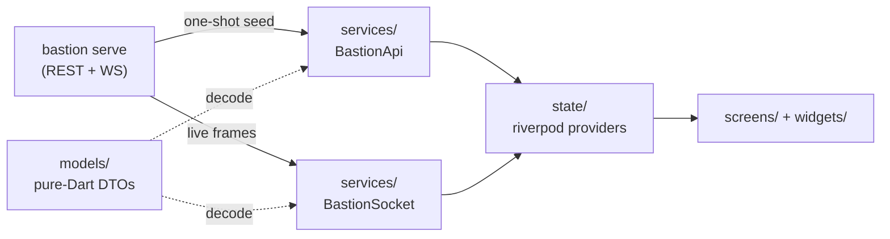

# BastionUI Architecture

## What this page is for

You are about to change how data moves through the app — add a provider, wire a new
screen to a route, or work out why a widget shows stale state — and you need the shape
before the detail. For *what the app can do*, read
[`capabilities.md`](capabilities.md); for what each screen contains,
[`pages.md`](pages.md); for the wire contract, [`api-reference.md`](api-reference.md).

BastionUI is a thin Flutter client over `bastion serve`'s HTTP+WebSocket API (contract
owned by the `bastion` repo's `bastion/docs/serve-api.md`; never edited here — see
CLAUDE.md Standing Rule 6). It talks only to the Tailscale tailnet, never shells out to
git/tmux, and stores the bearer token via `flutter_secure_storage`.

## How a fact reaches the screen



1. A provider seeds itself with **one REST call** through `BastionApi`.
2. It then **subscribes to a WebSocket topic** (sessions, pane, runs) or re-fetches when
   a matching `event` frame arrives (repo workflows — there is no push for those).
3. Every payload decodes through a pure-Dart DTO in `models/` that never imports Flutter.
4. A guard flag (e.g. `_sawWsSnapshot`) means a slow REST reply can never overwrite newer
   WS state.
5. Screens only ever read providers — no screen calls `BastionApi` for list state itself.

The engine mount (`EngineApi`, run launch/pause/resume/abort) is a **second, separate
client** with its own auth header and its own availability states; it is not a code path
of `BastionApi`.

## Directory map

```
lib/
├── main.dart               ← app entry, HomeShell (socket/API lifecycle), routing, tab bar
├── theme/
│   ├── app_theme.dart       — AppTheme.dark: single explicit Material 3 ThemeData built
│   │                          from AppTokens/StatusTones/AppTypography (no ColorScheme.fromSeed)
│   ├── tokens.dart          — AppTokens: cool-aurora color palette, radius ladder, glow
│   │                          values, alpha() helper
│   ├── status_tones.dart    — StatusTones ThemeExtension: 6 semantic tones (neutral/info/
│   │                          active/success/warning/danger), each fg/bg/border
│   └── typography.dart      — AppTypography.textTheme: Inter, Source Sans 3, JetBrains Mono
├── models/                 ← pure-Dart DTOs + frame (de)serialization (no Flutter imports)
│   ├── dto.dart             — HealthDto, ErrorPayload
│   ├── frame.dart           — BastionFrame sealed hierarchy (WS envelope) + ClientFrames
│   ├── session_dto.dart     — AgentState, SessionDto, PaneDto
│   ├── repo_status_dto.dart — RepoSummaryDto, RepoStatusDto, HandoffInfo, WorkflowStateDto
│   ├── action_dto.dart      — CommandMode, CommandModel, CommandRequest, CommandResponse
│   ├── board_dto.dart       — BoardDto, RepoBoardDto, BoardLaneDto, BoardBlockDto,
│   │                          BlockOriginDto, the BlockedByDto sealed family
│   ├── attention_dto.dart   — AttentionDto, AttentionLanesDto, AttentionCarryoverDto,
│   │                          AttentionBacklogDto, AttentionThresholdsDto
│   ├── lanes_dto.dart       — LanesDto, LaneSegmentDto (GET /api/lanes; no UI consumer yet)
│   ├── docs_dto.dart        — DocTreeDto, DocEntryDto, DocFileDto (no UI consumer yet)
│   └── run_dto.dart         — RunSummaryDto, RunStateDto, NodeTransitionDto, RunUsageDto
├── services/                ← transport layer
│   ├── bastion_api.dart     — REST client (BastionApi), Authorization: Bearer
│   ├── bastion_socket.dart  — WebSocket client with reconnect (BastionSocket)
│   ├── engine_api.dart      — engine-mount REST client (EngineApi), X-API-Key auth,
│   │                           serve-api.md §18
│   ├── serve_api_version.dart — kServeApiPin: the machine-checked contract pin
│   └── notifications.dart   — local-notification wrapper + riverpod wiring
├── state/                   ← riverpod providers
│   ├── connection_provider.dart — server config, engine key, live ConnectionStatus
│   ├── sessions_provider.dart   — live session list + bastionSocketProvider/bastionApiProvider injection points
│   ├── pane_provider.dart       — per-session live pane buffer
│   ├── events_provider.dart     — needs_input event stream + flag set
│   ├── repos_provider.dart      — workspace-registry repo list
│   ├── workflows_provider.dart  — per-repo status/workflows + workflow_done event stream
│   ├── runs_provider.dart       — run list: REST seed + live "runs" WS topic (BU.13.E)
│   ├── commands_provider.dart   — persisted user-editable command-palette list
│   ├── engine_workflows_provider.dart — live workflow-type registry behind the launch sheet
│   ├── briefing_model.dart      — pure view-model: BriefingViewModel, BriefingSectionState<T>
│   ├── briefing_provider.dart   — composes board+attention+sessions into three sections
│   ├── repo_board_provider.dart — typed per-repo block records from GET /api/board
│   ├── portfolio_ranking.dart   — pure rankPortfolio(): needsAttention/active/quiet tiers
│   └── blocked_by_label.dart    — pure: renders a BlockedByDto as operator-readable text
├── screens/                 ← full-page widgets (one per tab, plus detail/sheets)
│   ├── briefing_screen.dart      — tab 0
│   ├── sessions_list_screen.dart — tab 1
│   ├── session_detail_screen.dart
│   ├── dashboard_screen.dart     — tab 2
│   ├── repo_detail_screen.dart
│   ├── quick_actions_screen.dart — tab 3
│   ├── runs_screen.dart          — tab 4, incl. run detail + pause/resume/abort controls
│   ├── launch_sheet.dart         — LaunchSheet modal (repo + workflow type + spec slug)
│   └── settings_screen.dart      — host/port/token + optional engine key, pushed from app bar
└── widgets/                 ← presentational, mostly provider-free components
    ├── connection_banner.dart · responsive_scaffold.dart · session_card.dart
    ├── pane_view.dart · approve_button_row.dart · status_badge.dart
    ├── markdown_view.dart · workflow_progress.dart · command_invoke_sheet.dart
    ├── confirm_sheet.dart   — showConfirmSheet: the destructive-action gate (run abort)
    ├── brand/               — bastiel_lockup, eyebrow, gradient_top_bar, heading_rule,
    │                          icon_tile, panel_card, status_pill (barrel: brand.dart)
    └── instrument/          — age_chip, gate_card, lane_bar, severity_row, sparkline,
                               stat_tile (barrel: instrument.dart)
```

## Data flow

### Connection lifecycle

`main.dart`'s `HomeShell` owns the `BastionSocket`/`BastionApi` instances:

1. On first frame, reads persisted `ConnectionConfig` + bearer token
   (`state/connection_provider.dart`, backed by `FlutterSecureStorage`) and opens the
   socket (no-op if host is unconfigured).
2. Publishes the live socket/API instances onto the shared root-scope injection points
   `bastionSocketProvider` / `bastionApiProvider` (`state/sessions_provider.dart`) —
   plain `StateProvider<T?>`s, `null` until set, so screens pushed via the app's
   `Navigator` (an ancestor of `HomeShell`) still see the same live instances.
3. Bridges `BastionSocket.statusStream` into `connectionProvider` so `ConnectionBanner`
   and other widgets update in real time. `ConnectionBanner` shows distinct copy per
   `ConnectionStatus` (a subtitle CTA for `disconnected`, explanatory text for
   `reconnecting`) and is tappable in every state to push `SettingsScreen`.
4. Watches `connectionProvider` for config changes (e.g. after `SettingsScreen` saves)
   and reconnects automatically.

Once both providers are non-null, `HomeShell` renders `_ConnectedBody`, a bottom
`NavigationBar` with five tabs (`BriefingScreen`, `SessionsListScreen`, `DashboardScreen`,
`QuickActionsScreen`, `RunsScreen`) inside an `IndexedStack` (all screens stay mounted so
provider state survives tab switches).
`_ConnectedBody` also activates `notificationWiringProvider` and
`workflowDoneNotificationWiringProvider` (local-notification bridges) and shows a
foreground `SnackBar` on `workflow_done` events.

### REST + WS seed/live pattern

Most list-shaped state (`sessionsProvider`, `paneProvider`, `reposProvider`,
`repoWorkflowsProvider`, `runsProvider`) follows the same pattern: seed via a one-shot
REST call, then either subscribe to a WS topic for live updates (sessions, pane, runs)
or re-fetch on a matching WS `event` frame (repo workflows — there is no WS push for the
repo list itself). A boolean guard (e.g. `_sawWsSnapshot`) ensures a slower REST response
never overwrites state a faster WS frame already updated.

`runsProvider` (`state/runs_provider.dart`, BU.13.E) seeds via `BastionApi.getRuns()`
then subscribes to the bearer-authed `"runs"` WS topic, decoding `run_transition`/
`run_stream_status` events via the existing generic `EventFrame` (no new `BastionFrame`
subtype). A `run_transition` with `terminal: true` removes the run from state (a fresh
`GET /api/runs` would no longer return it); every other status, including `suspended`,
upserts it and leaves it live. The notifier subscribes once (ctor) and unsubscribes once
(dispose); reconnect re-subscription is handled by `BastionSocket`'s existing
active-topic replay, not reimplemented here.

`sessionsProvider`, `paneProvider`, and `repoWorkflowsProvider` filter their WS stream to
their own topic/session/repo, then apply rxdart `.debounceTime(~150ms)` (trailing) before
the notifier applies the frame — a burst of high-frequency frames coalesces to the single
latest value instead of thrashing a rebuild per frame (`BU.ticket.ws-debounce`).
`needsInputEventsProvider` (`events_provider.dart`) is a discrete one-shot prompt stream and
is deliberately left undebounced so no `needs_input` event is ever dropped or delayed.

`sessionsProvider` and `paneProvider` also re-run their one-shot REST seed on every
`BastionSocket.statusStream` transition into `connected` *after* the first (i.e. every
reconnect, not the initial connect) — a transient tailnet drop can otherwise leave a
notifier's `subscribe` un-replayed and its state stale until the next natural update.
Each notifier seeds its own `_everConnected` flag from `socket.status` at construction
time (the socket may already be connected by the time the notifier is built, so the
notifier's own listener would never otherwise observe the true first `connected` event).
The existing `_sawWsSnapshot`/`_sawWsFrame` precedence guards are unchanged, so a slow
re-seed can never clobber newer WS-delivered state.

### Routing

`BastionApp.onGenerateRoute` handles two dynamic route prefixes:
- `/sessions/<name>` → `SessionDetailScreen` (pushed from `SessionCard.onTap` via
  `sessionDetailRouteName()` in `sessions_list_screen.dart`)
- `/repos/<name>` → `RepoDetailScreen` (pushed from `_RepoRow.onTap` via
  `repoDetailRouteName()` in `dashboard_screen.dart`)

## Key types

- `BastionFrame` (`models/frame.dart`) — sealed class decoding the WS envelope
  `{"kind": ..., "payload": ...}` into `EchoFrame`, `ErrorFrame`, `SessionsFrame`,
  `PaneFrame`, `EventFrame`, `UnknownFrame` (unrecognised `kind`, forward-compatible),
  or `MalformedFrame` (decode failure). Never throws.
- `RepoSummaryDto` / `RepoStatusDto` / `HandoffInfo` / `WorkflowStateDto`
  (`models/repo_status_dto.dart`) — mirror serve-api.md's repo/workflow REST surface
  (pinned at v0.30 by block BU.11.A; `lib/services/serve_api_version.dart` holds the
  current machine-checked value). `WorkflowStateDto.currentTask` is a JSON integer
  (verified directly against serve-api.md rather than trusting the task spec's prose
  summary, which implied a string).
- `RepoWorkflowsState` (`state/workflows_provider.dart`) — `{status, workflows,
  loading}` snapshot for one repo, held by `RepoWorkflowsNotifier`.
- `EngineWorkflowsState` (`state/engine_workflows_provider.dart`, BU.12.E) — sealed:
  `EngineWorkflowsLoading` / `EngineWorkflowsUnavailable(EngineStatus, error?)` /
  `EngineWorkflowsLoaded(types)`, three states rather than a plain list so
  unconfigured/unmounted/unreachable stay distinguishable from a genuinely-empty
  registry.
- `RepoBadgeState` (`widgets/status_badge.dart`) — `idle` / `inFlight` / `hasHandoff`,
  in that priority order (in-flight outranks a pending handoff).
- `CommandRequest` / `CommandResponse` (`models/action_dto.dart`) — mirror
  `POST /api/actions/command` (serve-api.md §12.1 — version pin: `lib/services/serve_api_version.dart`). `CommandRequest.toJson()` omits
  `dir`/`model` when null and emits `session` only for `CommandMode.inject`,
  `name` only for `CommandMode.spawn`.
- `BoardDto` / `BoardLaneDto` / `BoardBlockDto` (`models/board_dto.dart`),
  `AttentionDto` / `AttentionLanesDto` / `AttentionCarryoverDto` /
  `AttentionBacklogDto` / `AttentionThresholdsDto` (`models/attention_dto.dart`), and
  `DocTreeDto` / `DocEntryDto` / `DocFileDto` (`models/docs_dto.dart`) — mirror
  serve-api.md v0.30 §13, §15, §16 (block BU.11.A). Every optional wire field decodes
  to a nullable Dart field with a safe default; `BoardBlockDto`'s three graph-gated
  fields (`dependentCount`, `ready`, `unmetCount`) are `null` (never a fabricated
  zero) unless the request passed `?graph=true`. `BoardBlockDto.lastTouched` is a
  nullable `DateTime` parsed (`DateTime.tryParse`) from the wire's ISO string; `null`
  unconditionally means "never worked" (never "worked long ago"), and a malformed wire
  string degrades to `null` rather than throwing.
- `PaletteCommand` (`state/commands_provider.dart`) — local `{label, command}` value
  object for the user-editable palette; not part of the serve-api contract.
- `BriefingViewModel` / `BriefingSectionState<T>` (`state/briefing_model.dart`) — pure,
  provider-free view-model for the Briefing tab. Three independently-stated sections (board,
  attention, sessions); ranking helpers (`rankedGates`, `rankedBlocked`, `rankedNeedsInput`)
  sort descending on `dependent_count`/`age_days`/idle time with nulls sorted last (never
  coerced to 0), ties broken on a stable id/slug/name key. `BriefingViewModel.needsInputIdle`
  is a `Map<String, Duration>` populated externally (by `briefing_provider.dart`) from
  `needs_input` event arrival time, since `SessionDto` carries no timestamp itself.
- `RunSummaryDto` / `RunStateDto` / `NodeTransitionDto` / `RunUsageDto`
  (`models/run_dto.dart`, BU.13.E) — mirror serve-api.md §14's runs surface
  (`GET /api/runs`, `GET /api/runs/{id}`, the `runs` WS topic). `RunSummaryDto` includes
  the v0.22 `repo` field even though it predates the v0.16 field set named in the
  original spec, per Standing Rule 6 (mirror the upstream contract exactly). Status
  fields decode as raw `String`, not an enum, matching `WorkflowStateDto`'s existing
  precedent — an unrecognised status value can never throw. Absent and explicit-null
  wire values both decode to Dart `null` throughout.

**Version pin.** `lib/services/serve_api_version.dart` exports `kServeApiPin`, the
exact serve-api contract revision the model layer above was written against.
`test/services/serve_api_version_test.dart` drift-tests it against a sibling
`../bastion` checkout when present, and skips (never fails) when that checkout is
absent — the pin is the app's only machine-checked contract-version marker; every
prior version reference here was prose that nothing checked.

## Dashboard + repo-detail flow (BU.2.A, 13.D)

- `DashboardScreen` (`ConsumerStatefulWidget`) watches `briefingBoardProvider`
  (`?graph=true`, root-scope — reused from the Briefing tab rather than a second
  board fetch) and feeds it through `rankPortfolio()` (`state/portfolio_ranking.dart`),
  which tiers repos into **Needs attention** / **Active** / **Quiet** and derives each
  repo's `RepoRecency` (`Known(DateTime)` vs `NeverWorked`) from the newest
  `lastTouched` across all five lanes. `now` is captured once in `initState` (never in
  `build`) and threaded down, so nothing in the row rereads the wall clock.
- Each tier renders its repos as `SeverityRow`s with a `LaneBar` (done/now/blocked/next
  counts) plus an `AgeChip` (or an honest "not started" chip for `NeverWorked` repos)
  and, when the repo had activity in the trailing 7 days, a `Sparkline` bucketed from
  each block's real `lastTouched` timestamp (a repo with no activity in that window
  renders no sparkline at all, never a fabricated flat zero row). The Quiet tier
  collapses by default to a single tap-to-expand summary row (first 3 names + "+N
  more"); tapping `portfolio-quiet-summary-tap` expands it.
  Pull-to-refresh calls the board provider's refresh.
- `StatusPill` tone mapping (per D4 constraint 3): an active/RUNNING repo reads louder
  (`StatusPillTone.active`, `tones.active`) than an idle/on-track one
  (`StatusPillTone.neutral`, `tones.neutral`) — fixed within `dashboard_screen.dart`'s
  per-tier `_pill` mapping rather than `status_pill.dart`'s global `statusToneFor`,
  since other screens rely on that function's existing tone semantics for unrelated
  states.
- `RepoDetailScreen` watches the same `repoWorkflowsProvider(repoName)` family for the
  parsed `RepoStatusDto` (rendered as a label/value table via `_StatusTable`) and the
  `WorkflowStateDto` list (one `WorkflowProgress` row each). When
  `status.hasHandoff` is true it also watches a screen-local
  `repoHandoffProvider` (`FutureProvider.family<HandoffInfo?, String>`) that calls
  `GET /api/repos/{name}/handoff` directly — a resolved `null` or fetch error both
  render nothing (`SizedBox.shrink()`), matching "omit without error".
- `repoWorkflowsProvider` auto-refetches whenever a `workflow_done` `EventFrame` with
  `extra['repo'] == repoName` arrives (via the shared `workflowDoneEventsProvider`),
  which is what flips the dashboard badge and repo-detail workflow list live, without a
  manual refresh.
- `workflowDoneNotificationWiringProvider` (`services/notifications.dart`) mirrors the
  existing needs-input notification bridge as a second, independent channel keyed by
  `'$repo:$specSlug'.hashCode` so distinct specs for the same repo don't collide.

## Command palette flow (BU.3.A)

- `commandsProvider` (`state/commands_provider.dart`) exposes `CommandsNotifier`, a
  persisted, user-editable list of `PaletteCommand {label, command}` entries. It is
  seeded with `defaultPaletteCommands` on first run and JSON-encoded under the
  `bastion.commands.list` key via the existing `secureStorageProvider` seam (no new
  storage dependency). A missing or unparseable stored value falls back to the
  defaults rather than throwing. Supports `add`/`update`/`delete`/`reorder`; malformed
  indices are silent no-ops.
- `QuickActionsScreen` (tab 2, `screens/quick_actions_screen.dart`) renders one tile per
  `PaletteCommand` (edit/delete `IconButton`s plus tap-to-invoke) with a FAB to add new
  entries via a shared add/edit `AlertDialog`.
- Tapping a tile opens `CommandInvokeSheet` (`widgets/command_invoke_sheet.dart`), a
  modal with an inject/spawn mode toggle: inject targets an existing session (picker
  backed by `sessionsProvider`); spawn takes a new session name, optional working dir,
  and optional model (`opus`/`sonnet`/server-default). On submit it calls
  `BastionApi.postCommand(CommandRequest)`, surfaces `ApiError`/`FatalAuthError`
  inline, and on success pops the sheet with the server-returned session id, which
  `QuickActionsScreen` uses to navigate to `/sessions/<name>`.

## Theming + responsive split (BU.4.A, BU.10.A)

- `AppTheme.dark` (`theme/app_theme.dart`) is a single, cached (`static final`) Material 3
  `ThemeData`, hand-built from `AppTokens` (color/radius/glow), `StatusTones.dark`, and
  `AppTypography.textTheme` — no `ColorScheme.fromSeed`. `main.dart`'s `MaterialApp` wires
  `theme: AppTheme.dark` / `themeMode: ThemeMode.dark`; there is no `AppTheme.light` and no
  `darkTheme` param (dark-only brand app, not a system-following light/dark pair).
- `StatusTones` is a `ThemeExtension<StatusTones>` registered in `AppTheme.dark.extensions`,
  giving six semantic tones (`neutral`/`info`/`active`/`success`/`warning`/`danger`), each a
  `StatusTone(foreground, background, border)`. Read it via `Theme.of(context).statusTones` or
  `context.statusTones` (extension methods with a safe `StatusTones.dark` fallback if
  unregistered). Named widgets (`ConnectionBanner`, `SessionCard`'s agent-state chip,
  `StatusBadge`, `PaneView`) source all state colors from this instead of hardcoded
  `Color(0x...)` literals — enforced by a guard test (`test/theme/no_color_literals_test.dart`)
  that fails on any `Color(0x...)`/`Colors.black`/`Colors.white` literal outside `lib/theme/`.
- Brand fonts (Inter, Source Sans 3, JetBrains Mono — vendored OFL variable TTFs under
  `assets/fonts/`, declared in `pubspec.yaml`) are wired in via `AppTypography.textTheme`.
- `ResponsiveScaffold` (`widgets/responsive_scaffold.dart`) renders `list` alone below a
  720dp-wide breakpoint (`kTabletBreakpoint`) and a `list` + `detail` `Row` split (flex
  2:5) at/above it. The static `ResponsiveScaffold.isWide(context)` helper exposes the
  same threshold so callers can branch push-navigation vs. inline selection.
- `SessionsListScreen` is the first consumer: on tablet widths it renders the sessions
  list and an inline `SessionDetailScreen(embedded: true)` for the
  `selectedSessionProvider`-selected session side by side via `ResponsiveScaffold`; on
  phone widths, tapping a `SessionCard` still pushes `/sessions/<name>` unchanged.
  `SessionDetailScreen`'s `embedded` flag suppresses the implied AppBar back button
  when rendered inline (there is no route to pop back from).

## Briefing flow (13.B)

- `BriefingScreen` (tab 0, `screens/briefing_screen.dart`) watches
  `briefingViewModelProvider` (`state/briefing_provider.dart`), which composes three
  independently-fetching `BriefingSectionNotifier<T>` sections — `GET /api/board`
  (`?graph=true`, paid on every load), `GET /api/attention`, and the existing
  `sessionsProvider` (wrapped as always-Loaded, since that provider never itself
  surfaces a REST-seed error) — into a single `BriefingViewModel`.
- Header stats (`BriefingHeader`) and the three lanes (gates, blocked, live runs) each
  read from `state/briefing_model.dart`'s pure ranking functions
  (`rankedGates`/`rankedBlocked`/`rankedNeedsInput`), so the same null-safe,
  descending-with-nulls-last logic backs both the counts and the lane contents.
- A section error degrades only the stats/lanes that depend on it (an em dash in the
  header, an inline per-lane error with retry) — the other sections keep rendering.
  `refreshFailedBriefingSections(ProviderContainer)` re-fetches only the errored
  sections; it takes a `ProviderContainer` rather than a `Ref`/`WidgetRef` so the same
  function is callable from tests and from screen code via
  `ProviderScope.containerOf(context, listen: false)`.
- Operator gates are `BoardBlockDto` blocked-lane entries whose `blockedBy` contains an
  operator/approval dependency; blocked blocks are sourced from
  `AttentionCarryoverDto.staleCarryover` filtered to `lane == 'blocking'` (`BoardBlockDto`
  has no `age_days` field on the wire). `GateCard.onAct` reuses the existing
  `repoDetailRouteName(gate.repo)` route rather than a new write path.

## Known contract gap

`WorkflowStateDto` has no PR-link field on the current serve-api contract —
`widgets/workflow_progress.dart` renders `branch` as plain text only, never a link. See
`planning/2.A-dashboard-repo-detail/tasks.md` for the tracked gap.
